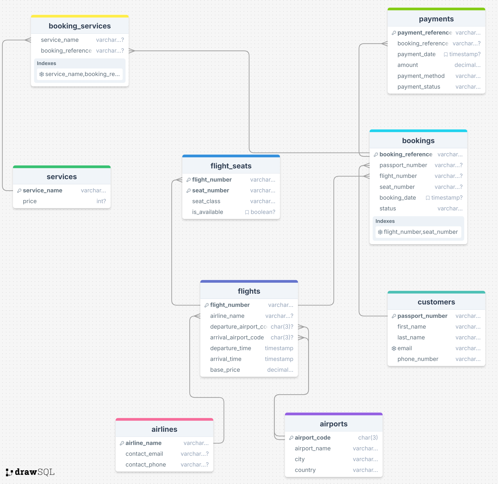
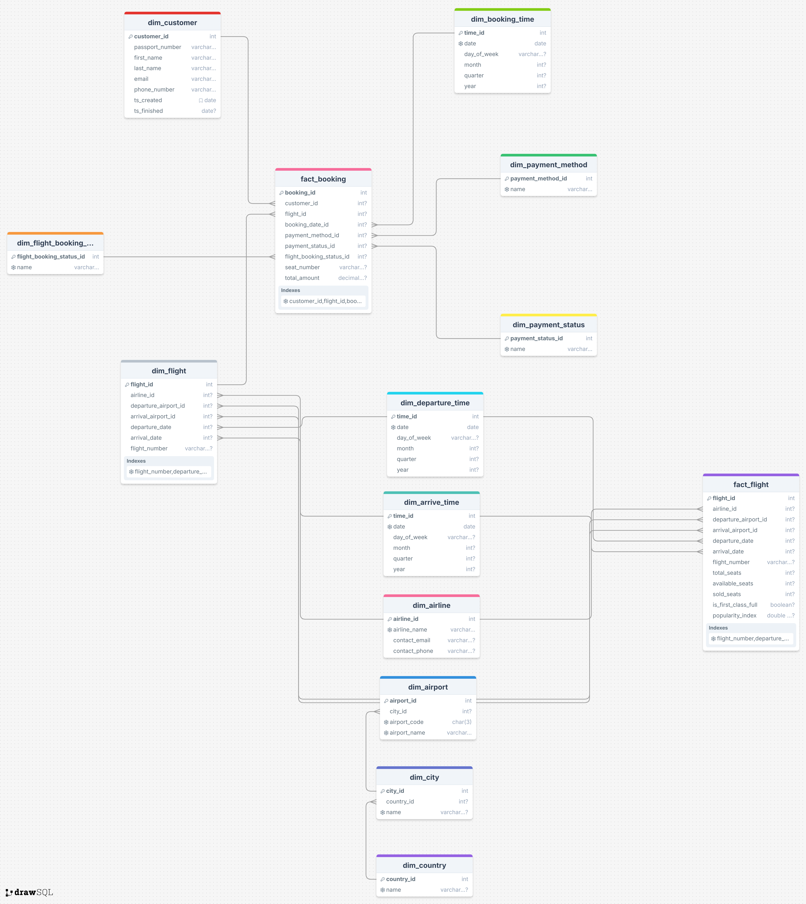

# Course work [2024 LR S5] SQL & Data Processing

## Tasks
### 1.1. Develop OLTP solution
*Design 3NF relational DB for full user action flow (8 tables)*

**OLTP Script path**: `oltp/sql/initial.sql`

**OLTP schema**:


### 1.2. Prepare data to load to your OLTP database – 2 datasets
*2 datasets*

I have made dataset not for 2 but for all tables. 
They are located in `oltp/data` folder with names, according table names.

### 1.3. Prepare script to load data from CSV to your OLTP database
*Check which data were already uploaded and add only new ones*

I have made import script and to not depend on OS I made **docker-compose file** to perform all needed actions.

#### How to init DB and import CSV files:
1. Install **Docker** and **docker-compose** if you don't have one.
2. Up a database on your local machine: `docker-compose up db`
3. Run OLTP init and migrate from CSV script: `docker-compose up oltp_migrate`

#### Updating data
You can just run `docker-compose up oltp_migrate` again. In the migration script (`oltp/sql/migrate.sql`) I am performing nothing on conflict.
```sql
INSERT INTO oltp.<table> (<fields>)
SELECT <fields>
FROM oltp.staging_<table>
ON CONFLICT (...) DO NOTHING;
```

### 2.1 Develop OLAP solution
*Design snowflake DWH (2 Facts, 1 SCD Type 2)*

**OLAP Script path**: `oltp/sql/initial.sql`

**OLAP schema**:

